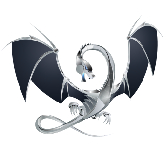

# 您好,开发者,爬
# hello,developer, climb


Ubuntu ^16
```bash
$ apt install clang
$ apt install llvm
$ clang++ -g jvavc.cpp `llvm-config --cxxflags --ldflags --system-libs --libs core` -o jvavc.out
$ ./jvavc.out
```

macOS ^10.12 Sierra
```bash
% chsh -s /bin/zsh
% /bin/zsh -c "$(curl -fsSL https://gitee.com/cunkai/HomebrewCN/raw/master/Homebrew.sh)"
% brew install llvm
% clang++ jvavc.cpp `llvm-config --cxxflags --ldflags --system-libs --libs core` -o jvavc.out
```

~~# 这是一个基于LLVM(Low Level Virtual Machine)的编译器前端JLC~~
~~This is a compiler front end JLC based on LLVM(Low Level Virtual Machine)~~

~~(中英双语)
(English/Chinese)~~

~~**请注意,此处的`前端`与常规前端不同,特指`编译器前端`**~~
~~**Note that the 'front end' here is different from the regular front end, specifically the 'compiler front end'**~~

---

~~操作系统要求: `Ubuntu 16`或以上, `Mac OS X 10.12(Sierra)`或以上
Operating system requirements: `Ubuntu 16` or above, `Mac OS X 10.12 (Sierra)` or above
暂不支持Windows(未来进行交叉编译)
Windows is not supported yet (cross-compilation in the future)~~

~~编译器要求: `clang 6.0`或以上
Compiler requirements: `clang 6.0` or above~~

~~首先执行使用apt安装clang和llvm
First install clang and llvm using apt~~
```bash
$ sudo apt install clang
$ sudo apt install llvm
```
~~查看clang是否安装成功
Check if clang is installed successfully~~
```bash
$ clang -v
$ clang++ -v
```
~~找到llvm目录(STLExtras.h在llvm/ADT/下):
Find the llvm directory (STLExtras.h under llvm/ADT/):~~
```bash
$ locate STLExtras.h
```
~~复制该文件夹到自己的目录(非必须)
Copy this folder to your own directory (optional)~~
```bash
$ sudo cp -Rf /usr/include/llvm-6.0/ ~/dev
```
~~把`jvavc.cpp`放入`llvm-6.0`下
Put `jvavc.cpp` under `llvm-6.0`~~
```
$ sudo cp ~/localFile/jvavc.cpp ~/dev/llvm-6.0/
```
~~执行编译,warning别管:
Execute compilation, warning don't care:~~
```
$ clang++ -g jvavc.cpp `llvm-config --cxxflags --ldflags --system-libs --libs core` -o jvavc.out
```
~~运行:
run:~~
```
./jvavc.out
```

~~目前可以输入数字表达式, 函数定义, 库函数调用
输出为codegen()生成的LLVM IR
You can now enter numeric expressions, function definitions, and library function calls
The output is LLVM IR generated by Codegen ()~~

---

~~# Works
编译器主要的流程是:
The main flow of the compiler is:~~

~~词法分析生成Token(通过状态机) -> 语法分析生成AST(递归下降)
->中间代码生成优化(LLVM IR)->平台无关代码和机器码指令
Lexical analysis generates Token (through state machine) -> grammatical analysis generates AST (recursive decline)
-> Intermediate code generation optimization (LLVM IR) -> Platform independent code and machine code instructions~~

~~这里LLVM为我们执行了代码生成部分的内容,
所以基于LLVM的Jvav编译器前端(JLC)的任务是词法分析和语法分析,
并通过LLVM Lib将AST转为LLVM IR
Here LLVM executed the content of the code generation part for us,
So the task of the Jvav compiler front end (JLC) based on LLVM is lexical analysis and grammatical analysis,
And convert AST to LLVM IR through LLVM Lib~~

---

~~# Information
编写者: [**约瓦夫开发团队**]( https://gitee.com/JvavDev/ )的無暝
Author: Amiriox of [**Jvav Development Team**]( https://gitee.com/JvavDev/ )~~

---

~~# About LLVM
> LLVM编译器基础结构项目是一组编译器和工具链技术，[3]可用于开发任何编程语言的前端，以及任何指令集体系结构的后端。LLVM 围绕一种与语言无关的中间表示形式（IR） 设计，该表示形式用作可移植的高级汇编语言，可以通过多次转换进行优化。 [4]~~

~~> The LLVM compiler infrastructure project is a set of compiler and toolchain technologies,[3] which can be used to develop a front end for any programming language and a back end for any instruction set architecture. LLVM is designed around a language-independent intermediate representation (IR) that serves as a portable, high-level assembly language that can be optimized with a variety of transformations over multiple passes.[4]~~

~~(From [Wikipedia](https://en.wikipedia.org/wiki/LLVM))~~

~~~~
